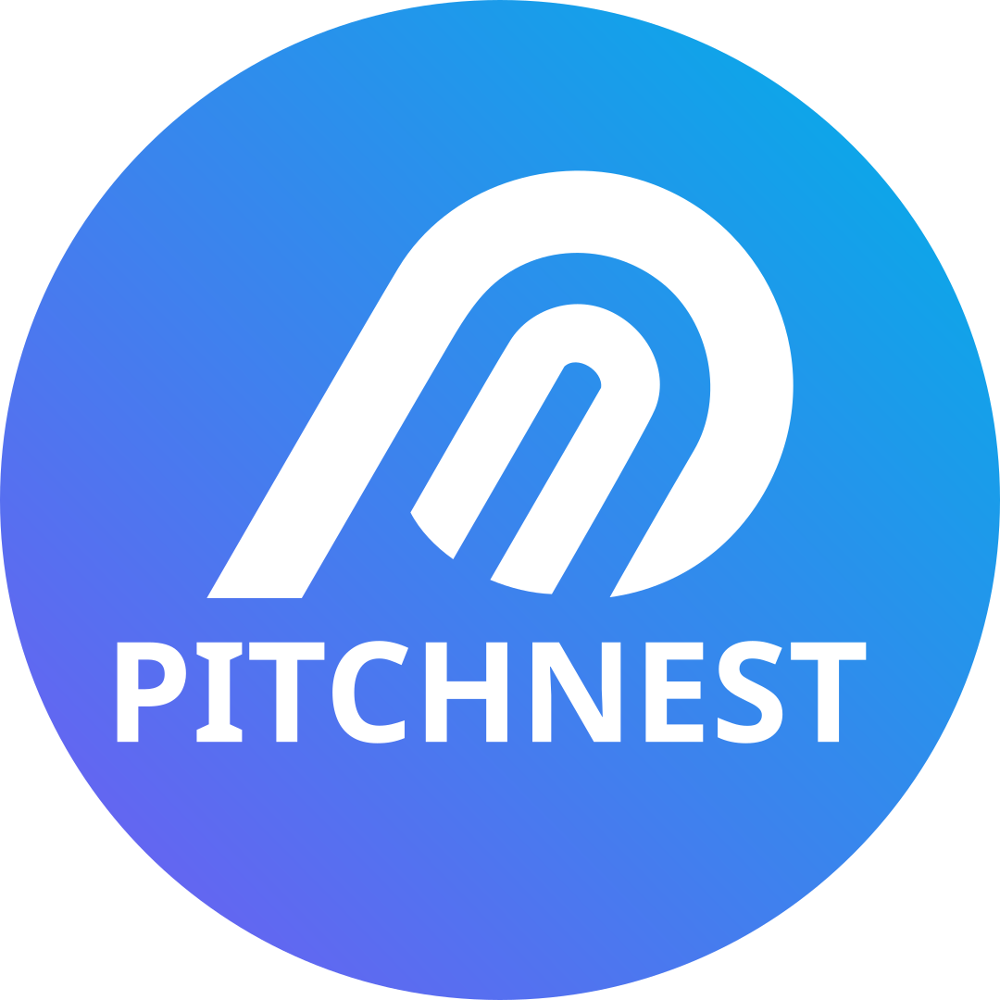

<p align="center">
  
</p>

<h1 align="center">PitchNest Backend</h1>

<p align="center">
  <strong>The AI Brain, Real-Time WebSocket Bridge, and API Engine for PitchNest</strong>
</p>

<p align="center">
  <a href="https://nodejs.org"></a>
  <a href="https://expressjs.com"></a>
  <a href="https://www.typescriptlang.org"></a>
  <a href="https://supabase.com"></a>
  <a href="https://azure.microsoft.com"></a>
  <a href="https://render.com"></a>
  <a href="LICENSE"></a>
</p>

---

## 🧠 Overview

**PitchNest Backend** powers the intelligent core of PitchNest. It bridges real-time human voice input with multimodal artificial intelligence, orchestrating high-stakes venture capital pitch simulations with sub-second voice latency:

* **Audio Streaming Bridge**: Streams microphone PCM audio chunks over WebSockets to **Azure Speech SDK** for real-time transcription.
* **Persona Intelligence Engine**: Dispatches transcripts to **Azure OpenAI / OpenAI** with customized personas (Marcus, Sarah, Chen, Riley) featuring conversational interjections and interruption handling.
* **Speech Synthesis**: Converts panel responses into natural human speech using **Azure Neural Voices** and streams audio buffers back to the client.
* **Deck Intelligence**: Extracts and indexes text and metrics from uploaded PDF pitch decks to ground panel discussions in the founder's actual numbers.
* **Billing & Entitlements**: Manages subscription levels (Free, Prep, Pro), usage quotas, and secure payment processing via **Flutterwave v3 Standard**.

---

## ✨ Core Services & Architecture

```text
               Founder Mic Audio (PCM16 / WebSocket)
                                │
                                ▼
            ┌────────────────────────────────────────┐
            │   restSocket.ts (Live State Machine)   │
            └──────┬───────────────────────────┬─────┘
                   │                           │
                   ▼                           ▼
          Azure Speech STT             Deck Intelligence
          (Live Transcription)         (Slide-delimited Context)
                   │                           │
                   └───────────┬───────────────┘
                               │
                               ▼
                    Azure OpenAI / OpenAI
                (Marcus, Sarah, Chen, Riley)
                               │
                               ▼
                        Azure Speech TTS
                      (Neural Voice Out)
                               │
                               ▼
               Founder Headphones (Audio Chunks)
```

- **Live WebSocket Bridge (`src/sockets/restSocket.ts`)**: Manages session state, interruption handling ("barge-in"), floor-control tags, and audio streaming.
- **AI Brain (`src/services/aiService.ts`)**: System prompts, personas, evaluation rubric, and deck audits.
- **Entitlement Service (`src/services/entitlementService.ts`)**: Enforces subscription quotas, session durations, and PDF download permissions.
- **Billing Service (`src/services/flutterwaveService.ts`)**: Hosted checkouts, raw-body webhook verification, and automated subscriber upgrades.
- **Storage & Documents (`src/services/storageService.ts` / `pdfService.ts`)**: PDF report synthesis with PDFKit and authenticated media delivery.

---

## 🛠️ Project Structure

```text
PitchNest-Backend/
├── migrations/            # SQL migration history for Supabase Postgres
├── scripts/               # Test and audit utility scripts
├── src/
│   ├── config/            # Environment configurations (env.ts, supabase.ts)
│   ├── controllers/       # Route controllers (auth, billing, decks, sessions, profile)
│   ├── middleware/        # AuthMiddleware, rateLimiter, adminMiddleware
│   ├── routes/            # Express API route declarations
│   ├── services/          # Business logic (ai, entitlement, speech, billing, storage)
│   ├── sockets/           # WebSocket real-time audio server (restSocket.ts)
│   ├── utils/             # Sanitizers, email helpers, math verifiers
│   └── app.ts             # Express app setup, CORS, security headers, routers
├── .env.example           # Example environment template
├── package.json           # Dependencies and scripts
├── server.ts              # HTTP & WebSocket server entry point
└── tsconfig.json          # TypeScript configuration
```

---

## 🏁 Getting Started

### Prerequisites
* **Node.js**: v20.x or later
* **npm**: v9.x or later
* **Supabase** account (Postgres URL & service keys)
* **Azure Cognitive Services** account (Speech Key & Region)
* **Azure OpenAI** or **OpenAI** API key

### Installation

```bash
# Clone the repository
git clone https://github.com/PitchNest-Lab/PitchNest-Backend.git
cd PitchNest-Backend

# Install dependencies
npm install
```

### Environment Configuration

Create a `.env` file in the root directory (refer to `.env.example`):

```bash
cp .env.example .env
```

Key configuration variables:
```env
PORT=3000
NODE_ENV=development
JWT_SECRET=your-secure-jwt-secret

# Supabase
SUPABASE_URL=https://your-project.supabase.co
SUPABASE_ANON_KEY=your-anon-key
SUPABASE_SERVICE_ROLE_KEY=your-service-role-key

# Azure Speech (Voice Input / Output)
AZURE_SPEECH_KEY=your-azure-speech-key
AZURE_SPEECH_REGION=eastus

# Azure OpenAI (or OPENAI_API_KEY)
AZURE_OPENAI_ENDPOINT=https://your-resource.services.ai.azure.com
AZURE_OPENAI_DEPLOYMENT=gpt-5.6-luna
AZURE_OPENAI_API_KEY=your-azure-key

# Transactional Email (Resend)
RESEND_API_KEY=re_your_api_key
EMAIL_FROM=PitchNest <hello@pitchnest.app>

# Billing (Flutterwave)
FLW_SECRET_KEY=FLWSECK-your-key
FLW_PUBLIC_KEY=FLWPUBK-your-key
FLW_WEBHOOK_HASH=your-webhook-hash
```

### Running Locally

```bash
npm run dev
```

* The server starts with `tsx watch server.ts` on port `3000`.
* Real-time logs and startup health checks will appear in the console.

### Running Tests

```bash
npm test
```

---

## 🌐 Production Deployment (Render)

1. Connect the `PitchNest-Backend` repository to a **Render Web Service**.
2. **Settings**:
   * **Root Directory:** *(leave blank / empty)*
   * **Build Command:** `npm install`
   * **Start Command:** `npm start`
3. Add your environment variables in the Render Dashboard.

---

## 🔗 Related Repositories

| Repository | Description |
| :--- | :--- |
| **[PitchNest-Frontend](https://github.com/PitchNest-Lab/PitchNest-Frontend)** | React 19 + Vite 6 web single-page application |
| **[PitchNest-Mobile](https://github.com/PitchNest-Lab/PitchNest-Mobile)** | Native iOS & Android companion mobile app (React Native / Expo) |

---

## 📄 License

This project is licensed under the MIT License.
